  

  
  
  
  
  

### About me

I'm a fourth-year Computer Engineering student at İstanbul Medeniyet University, graduating in 2027. Most of what I build runs on large language models. I fine-tune them for narrow tasks, connect them to tools and documents, and then work on making them fast enough to serve. That last step is my favorite part, because it decides whether a model becomes a product or stays in a notebook. This summer I did exactly that as an AI Engineer intern at İMÜ BİLTAM, working on agent and RAG pipelines and serving them with vLLM.

### Milestones

- 🏆 **5th place at TEKNOFEST 2026, Trendyol E-Commerce Competition.** Our team DualCore finished 5th of 377 teams in the Kaggle round, then 5th again among the 10 finalists with the second-highest F1 score in the final. I fine-tuned Gemma-4-12B with LoRA, built the hard-negative training set with Gemma-4-31B as the teacher, and designed the vLLM and Docker inference pipeline that explains each prediction with SHAP. On query-disjoint cross-validation the system reached 0.9452 Macro-F1.
- 🤝 **CV Analiz for İMÜ Teknopark.** I built and delivered a recruitment platform where recruiters manage candidate pools and positions, search candidates by keyword or by meaning, and get an AI evaluation of each CV. No CV reaches an external LLM with personal data in it. The platform parses every file in isolation and redacts PII locally first.

### Focus areas

- 🧠 **Fine-tuning LLMs for one job.** I use LoRA and PEFT on models like Gemma-4, generate training data with a larger teacher model, and keep the same query out of both train and test splits. I also want to know why a model made a call, so I check its predictions with SHAP, field occlusion and attention.
- 🔎 **Agents and retrieval.** Prompts split into system, context and user layers, tool calls that run on the backend, fallback to another model when one fails, and routing each workload to the model that fits it. Retrieval mixes keyword and vector search over pgvector or FAISS.
- ⚙️ **Serving models.** vLLM behind OpenAI-compatible APIs, Docker pipelines that return the same output on every run, and FastAPI with PostgreSQL behind Next.js frontends.
- 🖥️ **C on Linux.** POSIX threads, TCP sockets, shared-memory IPC, and desktop interfaces in GTK4 and SDL2.
- 🔌 **Next up.** Embedded systems, Edge AI and robotics, on hardware like the Raspberry Pi.

### Selected projects

<table>
  <tr>
    <td width="50%" valign="top">
      <h4><a href="https://github.com/omeraltinova/CopyGuard">CopyGuard</a></h4>
      
Runs locally and finds plagiarism in Turkish student assignments. It scores document pairs with MinHash, TF-IDF, sentence embeddings and section overlap, and can ask an LLM for a second opinion. Reports export as HTML, CSV or images.

      
<code>FastAPI</code> <code>Next.js</code> <code>SQLite</code> <code>Sentence Transformers</code>

    </td>
    <td width="50%" valign="top">
      <h4><a href="https://github.com/omeraltinova/GameMasterAI_web">GameMaster AI</a></h4>
      
A digital game master for tabletop campaigns built on the 5e SRD. Each model request carries the current session, characters and world state. The model calls tools that the backend executes, falls back to another model when one fails, and stays inside token quotas and rate limits.

      
<code>TypeScript</code> <code>OpenRouter</code> <code>PostgreSQL</code> <code>Prisma</code>

    </td>
  </tr>
</table>

  
<b>More projects in C</b>

   
<table>
  <tr>
    <td width="50%" valign="top">
      <h4><a href="https://github.com/omeraltinova/emergency-drone-coordination">Emergency Drone Coordination</a></h4>
      
A C client-server system that coordinates simulated rescue drones. Drones register, report status and receive missions as JSON over TCP. The server tracks heartbeats and handles reconnects and dropped clients across threads, and an SDL2 window shows drones and survivors live.

      
<code>C</code> <code>pthreads</code> <code>TCP sockets</code> <code>SDL2</code>

    </td>
    <td width="50%" valign="top">
      <h4><a href="https://github.com/omeraltinova/simple-shell">Simple-Shell</a></h4>
      
A multi-tab terminal emulator written in C and GTK4 with an MVC structure. It runs shell commands, manages processes, keeps command history, and passes messages between processes through POSIX shared memory.

      
<code>C</code> <code>GTK4</code> <code>POSIX IPC</code> <code>Linux</code>

    </td>
  </tr>
</table>

  
<h3>Toolbox</h3>

<table>
  <tr>
    <td><b>Languages</b></td>
    <td>&nbsp;Python &nbsp;&nbsp; &nbsp;C &nbsp;&nbsp; &nbsp;Java &nbsp;&nbsp; &nbsp;TypeScript &nbsp;&nbsp; &nbsp;JavaScript</td>
  </tr>
  <tr>
    <td><b>Machine learning</b></td>
    <td>&nbsp;PyTorch &nbsp;&nbsp; &nbsp;Transformers &nbsp;&nbsp; &nbsp;scikit-learn &nbsp;&nbsp; &nbsp;NumPy &nbsp;&nbsp; &nbsp;Pandas</td>
  </tr>
  <tr>
    <td><b>LLM tooling</b></td>
    <td>PEFT / LoRA &nbsp;&nbsp; vLLM &nbsp;&nbsp; Sentence Transformers &nbsp;&nbsp; FAISS &nbsp;&nbsp; SHAP</td>
  </tr>
  <tr>
    <td><b>Backend &amp; data</b></td>
    <td>&nbsp;FastAPI &nbsp;&nbsp; &nbsp;Flask &nbsp;&nbsp; &nbsp;PostgreSQL + pgvector &nbsp;&nbsp; &nbsp;SQLite &nbsp;&nbsp; &nbsp;Prisma</td>
  </tr>
  <tr>
    <td><b>Web &amp; tools</b></td>
    <td>&nbsp;Next.js &nbsp;&nbsp; &nbsp;React &nbsp;&nbsp; &nbsp;Node.js &nbsp;&nbsp; &nbsp;Docker &nbsp;&nbsp; &nbsp;Git &nbsp;&nbsp; &nbsp;Linux &nbsp;&nbsp; &nbsp;Raspberry Pi</td>
  </tr>
</table>

 

<picture>
  <source media="(prefers-color-scheme: dark)" srcset="https://raw.githubusercontent.com/omeraltinova/omeraltinova/output/snake.svg" />
  <source media="(prefers-color-scheme: light)" srcset="https://raw.githubusercontent.com/omeraltinova/omeraltinova/output/snake-light.svg" />
  
</picture>

  
<b>GitHub stats &amp; what I'm listening to</b>

   
  

    
    
    
  

   
  

    
  

